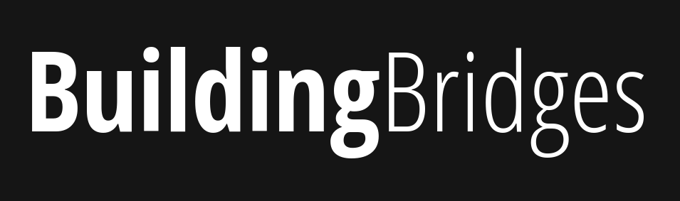
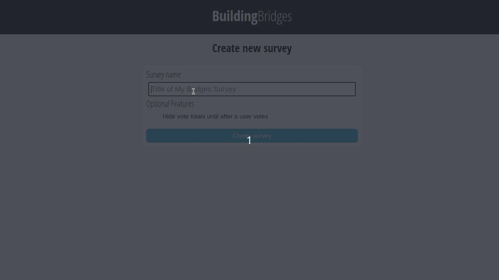

<p align="center">

<p align="center">
    
    <a href="https://opensource.org/licenses/MIT" alt="MIT">
        
    </a>
    
    
    
    
    
    
    
    
</p>


## Basic Overview

Building Bridges is a simple website, where users create surveys and ask questions. These questions can be voted on (up or down) - survey is sorted by the number of upvotes substracted by number of downvotes. This is very useful on big meetings, where people may not want to ask quesions directly, rather they want to ask questions before the meeting. Then, the owner of the meeting can answer the top interesting questions for users during the meeting.

<br/>

<p align="center">

</p>


<br/>


## Usage

### Prerequisites

#### For developers:
- `libxmlsec1-dev` and `pkg-config` (`apt-get install -y libxmlsec1-dev pkg-config` on Linux)
- Python 3.7+
- Nodejs 12+

#### For production:
- Docker
- MongoDB instance

### Docker way

We highly recommend using docker for your building bridges instance. To run a server, use:
```
docker run --name building-bridges -p 80:8888 -e ENV_VARIABLES -d ghcr.io/pegasystems/building-bridges:1.0.0
```

### Non-Docker way

If you don't want to use docker for your Building Bridges instance, you can simply run `./scripts/runBridges.sh` to build and run Building Bridges. You can also specify optional parameters here (ex. `./scripts/runBridges.sh -p 8000`).

### Configuration

Each parameter can be passed either in CLI as an argument or as a environment variable. The following table lists the configurable parameters of the Building Bridges (equivalent of `python3 -m bridges -h`):

| CLI Parameter  | ENV variable     | Description                                                                               | Default                   |
|----------------|------------------|-------------------------------------------------------------------------------------------|---------------------------|
| dburi          | DB_URI           | Uri of the mongo db instance                                                              | mongodb://localhost:27017 |
| dbuser         | DB_USER          | User name for authentication in database                                                  |                           |
| dbpassword     | DB_PASSWORD      | Password for authentication in database                                                   |                           |
| dbname         | DB_NAME          | Name of the mongo database                                                                | building-bridges          |
| port           | APP_PORT         | Port number of the building bridges service                                               | 8888                      |
| debug          | FLASK_DEBUG      | Enable Flask debug                                                                        | False                     |
| realipheader   | REAL_IP_HEADER   | If building bridges is behind reverse proxy, the proper client ip should be in the header | x-real-ip                 |
| contactemail   | CONTACT_EMAIL    | Contact email to show at the footer                                                       |                           |
| enablesaml     | SAML_ENABLED     | Enable saml authentication                                                                | False                     |
| samlproviderid | SAML_PROVIDER_ID | ID of the Identity Provider                                                               |                           |
| samlloginurl   | SAML_LOGIN_URL   | Login url of the Identity Provider                                                        |                           |
| samlcert       | SAML_CERT        | Certificate of the IdP                                                                    |                           |


<br>

## Security
Building Bridges, by default, doesn't require any login - website is open to everyone that knows the link and have access to the server. However, you can hide Building Bridges behind SAML authentication, so people outside your corporation won't have access to it. For more information about SAML, please see [this document](docs/SAML.md).


## Contributing
Please take a look at our [contributing](docs/CONTRIBUTING.md) guidelines if you're interested in helping!


## Authors and acknowledgment

Having this project here wouldn't have been possible without Meeples team at Pegasystems:

* Ryan DaRin
* Maciej Danielak
* Marek Jagielski
* Dominik Adamiak
* Piotr Kucia
* Agnieszka Pulnar
* Wojciech Buczek

## License
>You can check out the full license [here](LICENSE)

This project is licensed under the terms of the **MIT** license.